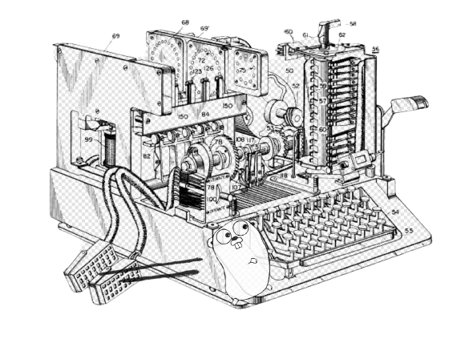

# enigma

<p align="center">
	<a href="https://goreportcard.com/report/github.com/clouddrove/enigma">
		
	</a>
	<a href="https://github.com/clouddrove/enigma/">
		
	</a>
	<a href="https://join.slack.com/t/devops-talks/shared_invite/zt-2s2rnal1e-bRStDKSyRC~dpXA~PaJ7vQ">
		
	</a>
	<a href="https://medium.com/devops-talks/announcing-devopstalks-spectacular-hacktoberfest-2024-363a09223c45">
		
	</a>
	<a href="https://choosealicense.com/licenses/mit/">
		
	</a>
</p>

<p align="center">

</p>

## Installation

### Source (Go >= 1.18)

* Clone and Build the Repo
```bash
# Clone the repository
git clone https://github.com/clouddrove/enigma

# Navigate into the project directory
cd enigma

# Install any dependencies (though this is typically handled automatically by go build)
go get .

# Build the project and output the binary as 'enigma'
go build -o bin/enigma
```

* Give permission to execute the binary
```
cd bin/

chmod +x enigma
```

* Create symlink to `/usr/local/bin`
```shell
sudo ln -s enigma /usr/local/bin/enigma

# Verify the symlink
ls -l /usr/local/bin/enigma
```

## Quick start

### Overview

Enigma is a tool designed to simplify the DevOps lifecycle, offering a seamless way to manage Docker environments, build, scan, and publish Docker images. Below is a quick guide to getting started with Enigma and using its core commands.

---

### 1. **Initialize the Enigmafile**

This command initializes the Enigmafile where environment variables are stored.

- **Command:** enigma

- **Arguments:**

    - --enigmafile [file_to_generate_enigma_vars] (Optional, Default: .enigma)

- **Subcommand:** init

- **Options:**

    - --d: Initialize for Docker

**Example:**

```bash

enigma --enigmafile .test init --d

Output:

Using enigma file: .test

Environment variables successfully written to .test

```

---

### 2. **Bake Command**

The bake command is used to set up and build Docker images.

- **Command:** enigma

- **Subcommand:** bake

- **Aliases:** bake

- **Description:** Builds and scans a Docker image.

- **Arguments:** No additional arguments required.

- **Options:**

    - --d: Uses Docker when set.

**Docker-specific steps:**

- Loads the Docker environment.

- Installs the necessary binfmt.

- Builds the Docker image.

- Scans the Docker image for vulnerabilities.

**Example:**

```bash

enigma bake --d

```

---

### 3. **Publish Command**

The publish command is used to tag and push Docker images to a remote repository.

- **Command:** enigma

- **Subcommand:** publish

- **Aliases:** publish

- **Description:** Publishes Docker images by tagging and pushing them.

- **Arguments:** No additional arguments required.

- **Options:**

    - --d: Uses Docker when set.

**Docker-specific steps:**

- Loads the Docker environment.

- Installs binfmt.

- Tags the Docker image.

- Pushes the Docker image to a registry.

**Example:**

```bash

enigma publish --d

```

---

### 4. **Build-Publish Command**

The build-publish command combines the steps of building, scanning, tagging, and publishing a Docker image in one command.

- **Command:** enigma

- **Subcommand:** build-publish

- **Aliases:** bdpb, build-p

- **Description:** Builds, scans, and optionally publishes Docker images.

- **Arguments:** No additional arguments required.

- **Options:**

    - --d: Uses Docker when set.

**Docker-specific steps:**

- Loads the environment variables from the Enigmafile.

- Installs binfmt.

- Builds and scans the Docker image.

- If the PUBLISH environment variable is set to true, tags and pushes the image.

**Example:**

```bash

export PUBLISH=true

enigma build-publish --d

```

**Output if PUBLISH is set to false:**

```bash

Publish is set to false. Skipping publish step.

```

## Options

```shell
Enigma is a tool designed to simplify the DevOps lifecycle, offering a seamless way to manage tools environments, 
        build, scan, and publish. Below is a quick guide to getting started with Enigma and using its core commands.

Usage:
  enigma [flags]
  enigma [command]

Available Commands:
  bake          To Bake the command
  build-publish To build and publish
  completion    Generate the autocompletion script for the specified shell
  help          Help about any command
  init          To init the command
  publish       To publish

Flags:
      --enigmafile string   Path to the .enigma file (default ".enigma")
  -h, --help                help for enigma

Use "enigma [command] --help" for more information about a command.
```


## Contributors
<a href="https://github.com/clouddrove/enigma/graphs/contributors">
  
</a>